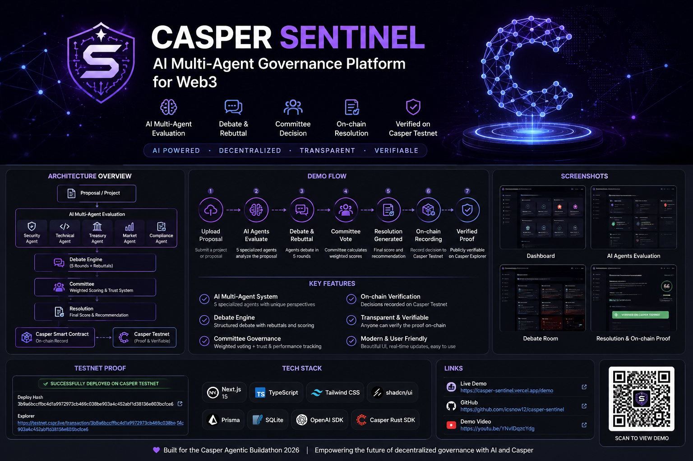

# Casper Sentinel



AI Multi-Agent Governance Platform for Web3

Built for Casper Agentic Buildathon 2026.

Casper Sentinel is an autonomous VC DAO terminal for Web3, DeFi, and RWA investment governance. A project is submitted once, then specialized AI agents perform diligence, cast reputation-weighted votes, debate each other, generate an investment committee resolution, and prepare a Casper Testnet proof for the final decision hash.

## Real Casper Testnet Proof

Casper Sentinel's governance contract was successfully deployed in a real Casper Testnet transaction. This is public on-chain proof, not a mock or demo receipt.

- **Status:** Success
- **Deploy hash:** [`3b9a6bccffbc4d1a9972973cb469c038be903a4c452abf1d38136e803b9cfce6`](https://testnet.cspr.live/transaction/3b9a6bccffbc4d1a9972973cb469c038be903a4c452abf1d38136e803b9cfce6)
- **Network:** Casper Testnet
- **Transaction payment:** 100 CSPR
- **Consumed gas:** 65.29352 CSPR
- **Charged amount:** 73.97014 CSPR
- **Caller:** `02034b5cccf5c4276ce33c7deddb067392530e2b115862c3a179f55f9349fa45cd22`

The application still uses demo proof fallback when real Testnet signing configuration is unavailable, and labels that mode separately.

## Problem

Web3 investment decisions are often fragmented across chats, spreadsheets, opaque analyst notes, and informal governance votes. DAOs and venture teams need a way to make diligence explainable, repeatable, auditable, and verifiable without publishing sensitive internal analysis on-chain.

## Solution

Casper Sentinel turns investment diligence into a structured autonomous workflow:

- Project intake captures whitepaper, repository, and token information.
- Five AI agents independently evaluate the project.
- Each agent casts a formal vote.
- Votes are adjusted by demo reputation scores.
- AI agents challenge assumptions, rebut each other, and form consensus.
- An Investment Committee Agent creates the final resolution.
- A canonical decision payload is hashed with SHA-256.
- The resolution is prepared for real Casper Testnet recording.
- Demo mode works without OpenAI credentials or Casper Wallet.

## Architecture

Stack:

- Next.js 15 App Router
- TypeScript
- Tailwind CSS v4
- shadcn/ui
- OpenAI SDK
- Prisma + SQLite schema
- Casper Wallet-ready UI
- Casper Testnet dual-mode recording adapter
- Verified real Casper Testnet contract deployment

Core flow:

```txt
Project Intake
↓
Agent Analysis
↓
Weighted Voting
↓
AI Debate
↓
Committee Resolution
↓
Casper Proof
```

## AI Agents

The Phase 2 engine includes:

- Technical Agent
- Market Agent
- Security Agent
- Compliance Agent
- Treasury Agent

Each agent returns:

- summary
- strengths
- concerns
- red flags
- score
- confidence
- risk
- recommendation
- evidence

When `OPENAI_API_KEY` is missing, the app returns realistic mock outputs so the demo remains reliable.

## Committee And Voting

Phase 3 and Phase 6 add:

- Investment Committee Agent
- Debate transcript
- Disagreement detection
- Formal agent votes
- Reputation-aware vote weights
- AI Committee Debate Engine
- Agent challenges and rebuttals
- Consensus score
- Conflict heat score
- Debate-adjusted final recommendation
- Final recommendation
- Investment memo
- Conditions precedent
- Decision payload
- SHA-256 decision hash

Weights:

- Technical: 20%
- Market: 15%
- Security: 25%
- Compliance: 20%
- Treasury: 20%

Demo trust scores:

- Technical Agent: 86
- Market Agent: 78
- Security Agent: 91
- Compliance Agent: 84
- Treasury Agent: 81

## Casper Integration

Phase 4 adds a hackathon-safe Casper Testnet recording layer:

- Casper Wallet connection panel
- Public key display
- Network display: Casper Testnet
- Canonical on-chain payload preparation
- Payload hash
- Demo-safe transaction proof
- Real-mode backend RPC attempt for signed transaction/deploy payloads
- Featured successful Testnet deployment with a public explorer link
- Status states including `READY_FOR_TESTNET_RECORDING`, `DEMO_RECORDED`, and `SUBMITTED`

The app submits new real transactions only when server-side Testnet signing configuration or a signed Casper payload is available. Demo mode remains the fallback and never claims on-chain confirmation.

## One-Click Demo

Open:

```txt
http://localhost:3000/demo
```

Or click `Run Live Demo` from the landing page or dashboard.

The demo runs:

1. Project intake
2. AI agents analyze
3. Agent votes
4. AI committee debate
5. Committee review
6. Resolution
7. Casper Testnet proof

## Screenshots

Add final submission screenshots here:

- Landing page
- One-click judge demo
- AI Committee Debate Engine
- Committee resolution
- Casper proof recording panel

## Environment Variables

Copy `.env.example` to `.env`.

```bash
DATABASE_URL="file:./dev.db"
OPENAI_API_KEY=""
OPENAI_MODEL="gpt-4.1-mini"
CASPER_TESTNET_RPC_URL="https://node.testnet.casper.network/rpc"
```

Optional:

- Add `OPENAI_API_KEY` to run live OpenAI agent calls.
- Leave it empty to use demo mode.
- Add a Casper Wallet extension to test wallet connection UI.
- Leave wallet disconnected to use demo proof mode.

## Run Locally

```bash
npm install
npm run dev
```

Open:

```txt
http://localhost:3000
```

Validation:

```bash
npm run lint
npx tsc --noEmit
npm run build
```

Prisma:

```bash
npm run prisma:generate
npm run prisma:migrate
npm run prisma:studio
```

Note: In this Windows environment, Prisma schema validation and client generation work, but SQLite migration execution may fail due to a local Prisma schema-engine issue. The app demo does not depend on database persistence.

## Hackathon Submission Summary

Casper Sentinel demonstrates a production-grade direction for autonomous investment governance:

- AI agents perform transparent Web3/RWA diligence.
- Agent reputation influences formal votes.
- The committee generates a defensible DAO resolution.
- The final decision is reduced to a canonical hash.
- Casper Testnet recording is prepared through a safe dual-mode adapter.
- Judges can run the full AI governance demo without keys. The real Casper Testnet proof is publicly verifiable on CSPR.live. To submit a new on-chain proof, use the documented Testnet deployment flow with your own funded Casper Testnet key.
